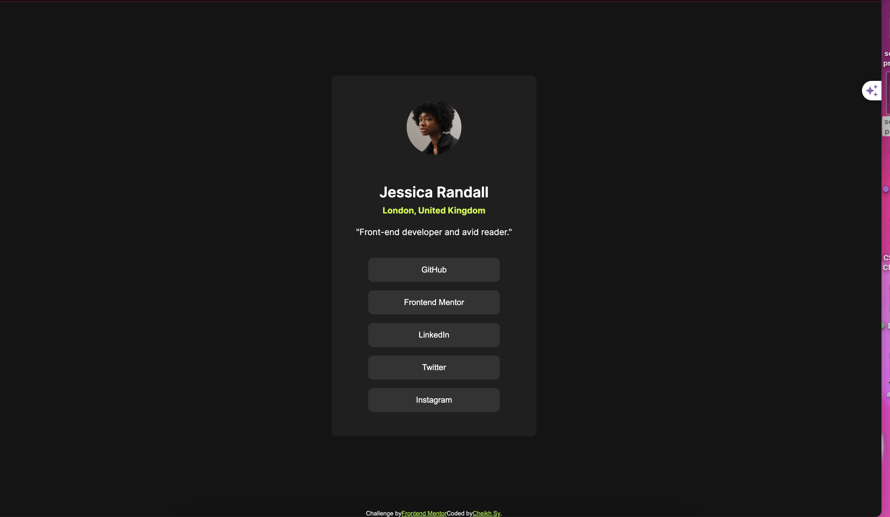

# Frontend Mentor - Social links profile solution

This is a solution to the [Social links profile challenge on Frontend Mentor](https://www.frontendmentor.io/challenges/social-links-profile-UG32l9m6dQ). Frontend Mentor challenges help you improve your coding skills by building realistic projects. 

## Table of contents

- [Overview](#overview)
  - [The challenge](#the-challenge)
  - [Screenshot](#screenshot)
  - [Links](#links)
- [My process](#my-process)
  - [Built with](#built-with)
  - [What I learned](#what-i-learned)
  - [Continued development](#continued-development)
  - [Useful resources](#useful-resources)
- [Author](#author)

## Overview

### The challenge

Users should be able to:

- See hover and focus states for all interactive elements on the page

### Screenshot

### Links

- Solution URL: (https://chkhs.github.io/Social-links-profile-main/)

## My process

### Built with

- Semantic HTML5 markup
- Flexbox
- CSS Grid
- Mobile-first workflow

### What I learned

How to create interactive hover and focus states for buttons.
Effective use of Flexbox for layout alignment and responsiveness.

### Continued development

Further refine hover effects and transitions.
Improve accessibility features and cross-browser compatibility.

### Useful resources

Flexbox Guide - Great resource for understanding Flexbox properties and layout.
MDN Web Docs - Comprehensive reference for HTML, CSS, and JavaScript.

## Author

- Website - [Cheikh Sy](https://chkhs.github.io/Social-links-profile-main/)
- Frontend Mentor - [@chkhs](https://www.frontendmentor.io/profile/chkhs)
